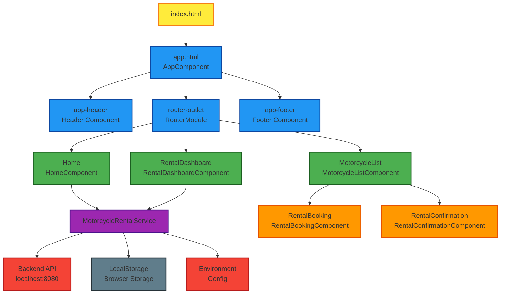

# Motorcycle Rental Frontend - Component Diagram

## Architecture Overview

This Angular application follows a component-based architecture with standalone components, services, and models.

## Component Diagram

## Component Details

### Main Components

1. **AppComponent** - Root component that serves as the application shell
2. **HomeComponent** - Landing page displaying featured motorcycles
3. **MotorcycleListComponent** - Main browsing interface for motorcycles with filtering and booking
4. **RentalDashboardComponent** - Administrative interface for managing rentals

### Sub-components

1. **RentalBookingComponent** - Modal form for creating motorcycle rental bookings
2. **RentalConfirmationComponent** - Confirmation screen after successful booking

### Services

1. **MotorcycleRentalService** - Central service handling all API communications with the backend

### Key Features

- **Standalone Components**: All components are standalone (no NgModules)
- **Reactive Forms**: Uses Angular reactive forms for data handling
- **Service Injection**: Uses `inject()` function for dependency injection
- **TypeScript Interfaces**: Strong typing with comprehensive model definitions
- **API Integration**: RESTful communication with backend services

### Data Flow

1. Components request data through `MotorcycleRentalService`
2. Service makes HTTP calls to backend API
3. Data flows back through observables to components
4. Components update UI based on received data
5. User interactions trigger new service calls or component state changes

### Routing Structure

- `/` - HomeComponent (landing page)
- `/motorcycles` - MotorcycleListComponent (browse motorcycles)
- `/dashboard` - RentalDashboardComponent (manage rentals)
- `/contact` - HomeComponent (placeholder)

## Technology Stack

- **Framework**: Angular (Standalone Components)
- **Language**: TypeScript
- **Styling**: CSS
- **HTTP Client**: Angular HttpClient
- **State Management**: Component-level state with signals
- **Routing**: Angular Router
